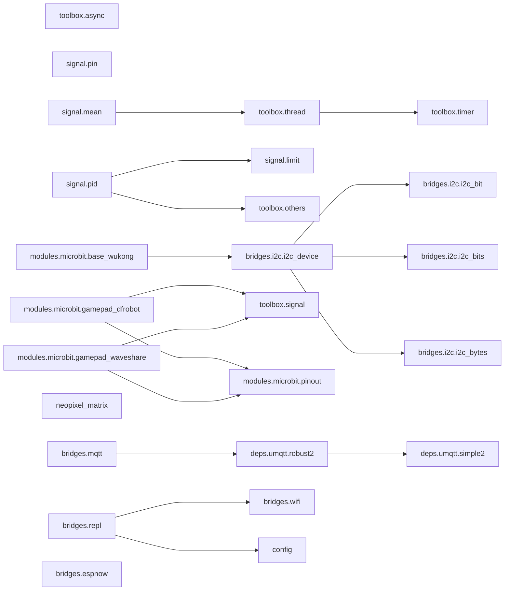

```mermaid
flowchart LR
  toolbox.thread ----> toolbox.timer
  toolbox.async
  signal.pin
  signal.pid   ----> signal.limit
  signal.pid   ----> toolbox.others
  signal.mean  ----> toolbox.thread
  modules.microbit.base_wukong       ----> bridges.i2c.i2c_device
  modules.microbit.gamepad_dfrobot   ----> toolbox.signal
  modules.microbit.gamepad_dfrobot   ----> modules.microbit.pinout
  modules.microbit.gamepad_waveshare ----> toolbox.signal
  modules.microbit.gamepad_waveshare ----> modules.microbit.pinout
  neopixel_matrix
  deps.umqtt.robust2 ----> deps.umqtt.simple2
  bridges.repl ----> bridges.wifi
  bridges.repl ----> config 
  bridges.mqtt ----> deps.umqtt.robust2 
  bridges.espnow
  bridges.i2c.i2c_device ----> bridges.i2c.i2c_bit
  bridges.i2c.i2c_device ----> bridges.i2c.i2c_bits
  bridges.i2c.i2c_device ----> bridges.i2c.i2c_bytes

```